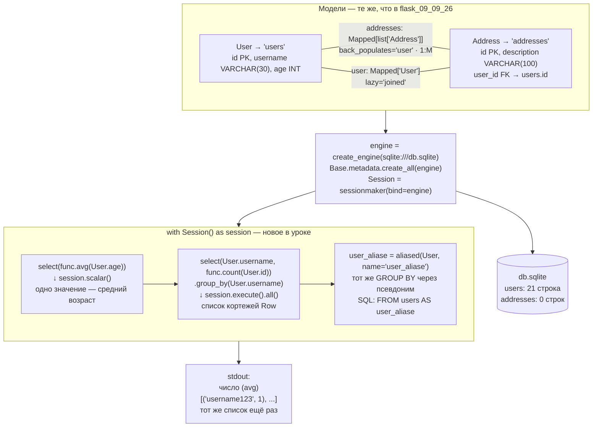

# 10_09_26 — схема проекта

## Что это

Продолжение урока 09.09.26: те же две модели и та же схема БД, новое — **агрегатные функции**
(`avg`, `count`), **группировка** `GROUP BY` и **псевдонимы таблиц** (`aliased`).

Flask не используется. Вход — база данных, выход — печать в консоль.

## Точка входа и запуск

```
cd 10_09_26
python app.py
```

Каталог начинается с цифры, а это недопустимый идентификатор Python, поэтому `import 10_09_26.app`
не работает — файл запускается напрямую. `__init__.py` формально есть, но пользы от него нет.

`create_engine('sqlite:///db.sqlite')` — путь относительный. Готовый `db.sqlite` лежит внутри
`10_09_26/`, поэтому запускать нужно из этого каталога.

## Схема



## Вход / Выход

| | |
|---|---|
| **Вход** | файл `db.sqlite`; параметров у запросов нет — они без `WHERE` |
| **Выход** | три строки в stdout: среднее по `age`, результат группировки, тот же результат через псевдоним. Базу скрипт не изменяет |

### Три запроса подробно

| Запрос | SQL | Метод выполнения | Результат |
|---|---|---|---|
| Средний возраст | `SELECT avg(age) FROM users` | `session.scalar(...)` | одно число |
| Группировка | `SELECT username, count(id) FROM users GROUP BY username` | `session.execute(...).all()` | `[('username123', 1), ...]` |
| То же через псевдоним | `SELECT user_aliase.username, count(user_aliase.id) FROM users AS user_aliase GROUP BY ...` | `session.execute(...).all()` | идентичен предыдущему |

## Связи

Импортов из проекта нет — весь код в одном `app.py`. Внешняя зависимость — `sqlalchemy`.
Единственная внешняя связь — файл `db.sqlite` в том же каталоге.

Схема БД совпадает со схемой в [`flask_09_09_26`](../flask_09_09_26/SCHEMA.md) (там же — фильтры
`WHERE` и сортировки). Продолжение темы — [`11_09_26`](../11_09_26/SCHEMA.md): `HAVING`,
подзапросы, стратегии загрузки связей.

## Особенности

* **Где `scalar`, а где `execute`.** `session.scalar()` берёт первую колонку первой строки —
  годится для одиночного агрегата. Для группировки колонок две, и `scalars()` вернул бы только
  первую: `count` потерялся бы молча. Поэтому `execute().all()`.
* **Правило SQL про GROUP BY**: всё, что не под агрегатной функцией, обязано быть в `GROUP BY`.
* **Зачем нужен `aliased`.** В этом файле результат с псевдонимом и без него одинаковый — это
  чистая демонстрация синтаксиса. Практический смысл появляется, когда на одну таблицу нужно
  сослаться дважды в одном запросе: самосоединение, сравнение строк таблицы между собой.
* **`label` импортирован, но не используется.** Присвоение имени вычисляемой колонке
  (`.label('addr_count')`) разбирается в [`11_09_26`](../11_09_26/SCHEMA.md).
* **`addresses` пуста** (0 строк), поэтому объявленная связь `relationship` в запросах этого
  урока никак не участвует.
* `and_`, `or_`, `not_`, `desc` импортированы из прошлого урока и здесь не нужны.
