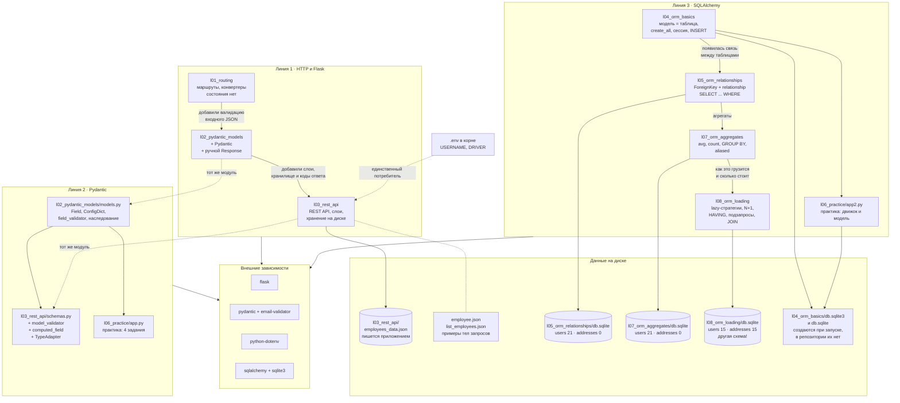

# Индекс проектов и схема связей

Учебный репозиторий курса по Flask. Каждый каталог — отдельный проект, названный по номеру
занятия (в хронологическом порядке) и теме.

Каталогов две серии:

* **`l…` — уроки.** Материал занятия, разобранный на примерах преподавателя.
* **`p…` — практика и классные работы.** Самостоятельные решения. Номер у практики тот же,
  что у урока, к которому она относится: `p02_pydantic_classwork` — это работа к `l02_pydantic_models`.
  Читать их полезно рядом: одна и та же задача, разные компромиссы.
Проекты **независимы**: ни один из них не импортирует другой, общего кода и общей базы нет.
Связывает их только линия обучения — каждая следующая тема опирается на предыдущую.

Подробная схема каждого проекта лежит рядом с его кодом, в файле `SCHEMA.md`.

**Единое правило запуска: из каталога проекта.** Заходим в папку урока и запускаем файл —
никаких `python -m пакет.модуль` из корня. Все относительные пути (`db.sqlite`,
`employees_data.json`) разрешаются от текущего каталога, поэтому так они всегда попадают
рядом с кодом урока.

Учебные ошибки в коде **сохранены намеренно**: неправильный вариант оставлен рядом
закомментированным, с пометкой «так НЕ надо» и разбором последствий, а рабочей строкой
идёт правильная. Искать глазами сломанный код не нужно — всё запускается.

## Индекс

| Каталог | Тема занятия | Стек | Тип | Точка входа | Схема |
|---|---|---|---|---|---|
| `l01_routing` | маршрутизация, конвертеры путей | Flask | веб-сервер | `cd l01_routing && python app.py` | [SCHEMA](l01_routing/SCHEMA.md) |
| `l02_pydantic_models` | Pydantic: модели, валидаторы, `Response` | Flask + Pydantic | веб-сервер | `cd l02_pydantic_models && python app.py` | [SCHEMA](l02_pydantic_models/SCHEMA.md) |
| `l03_rest_api` | REST API «сотрудники», слои, хранение в JSON | Flask + Pydantic + dotenv | **REST API** | `cd l03_rest_api && python app.py` | [SCHEMA](l03_rest_api/SCHEMA.md) |
| `l04_orm_basics` | первые модели ORM, 3 способа маппинга | SQLAlchemy | скрипт | `cd l04_orm_basics && python app_1.py` (и `app_2.py`) | [SCHEMA](l04_orm_basics/SCHEMA.md) |
| `l05_orm_relationships` | `relationship` 1:M, фильтры `WHERE` | SQLAlchemy | скрипт | `cd l05_orm_relationships && python app.py` | [SCHEMA](l05_orm_relationships/SCHEMA.md) |
| `l06_practice` | практика: 4 задания Pydantic + 2 SQLAlchemy | Pydantic, SQLAlchemy | скрипт | `cd l06_practice && python app.py` (и `app2.py`) | [SCHEMA](l06_practice/SCHEMA.md) |
| `l07_orm_aggregates` | агрегаты, `GROUP BY`, `aliased` | SQLAlchemy | скрипт | `cd l07_orm_aggregates && python app.py` | [SCHEMA](l07_orm_aggregates/SCHEMA.md) |
| `l08_orm_loading` | стратегии `lazy`, N+1, `HAVING`, подзапросы | SQLAlchemy | скрипт | `cd l08_orm_loading && python app.py` | [SCHEMA](l08_orm_loading/SCHEMA.md) |
| `l09_orm_practice` | запросы: фильтры, `limit`, вставка, удаление, агрегат | SQLAlchemy | скрипт | `cd l09_orm_practice && python app.py` | [SCHEMA](l09_orm_practice/SCHEMA.md) |

### Практика и классные работы

| Каталог | К какому уроку | Тема | Стек | Точка входа | Схема |
|---|---|---|---|---|---|
| `p01_routing_practice` | `l01_routing` | конвертеры путей, ответы JSON | Flask | `cd p01_routing_practice && python app.py` | [SCHEMA](p01_routing_practice/SCHEMA.md) |
| `p02_pydantic_classwork` | `l02_pydantic_models` | своё решение того же занятия | Flask + Pydantic | `cd p02_pydantic_classwork && python app.py` | [SCHEMA](p02_pydantic_classwork/SCHEMA.md) |
| `p03_rest_api_classwork` | `l03_rest_api` | тот же REST API, но **одним файлом** | Flask + Pydantic | `cd p03_rest_api_classwork && python app.py` | [SCHEMA](p03_rest_api_classwork/SCHEMA.md) |
| `p06_pydantic_tasks` | `l06_practice` | те же 4 задания, второе решение | Pydantic | `cd p06_pydantic_tasks && python app.py` | [SCHEMA](p06_pydantic_tasks/SCHEMA.md) |

Flask есть только в первых трёх уроках и в практике `p01`–`p03`. Начиная с 08.09 занятия
про базу данных, и веб-слоя в них нет вообще — это обычные скрипты, которые выполняются
сверху вниз и завершаются.

Исходники практики до обработки лежат в ветке **`practic`**: там всё как было написано
на занятиях, без переименований и исправлений.

## Схема связей

## Кто чем связан на самом деле

| Вопрос | Ответ |
|---|---|
| Импортируют ли проекты друг друга? | **Нет.** Ни одного межпроектного импорта. Единственные внутренние импорты — внутри `l02_pydantic_models` (`app.py → models.py`) и внутри `l03_rest_api` (`app.py → schemas.py → utils.py → settings.py`) |
| Общая база данных? | **Нет.** Четыре отдельных файла БД в четырёх каталогах (`db.sqlite` в трёх плюс `practicum3.db` в `l09`). У `l08_orm_loading` вдобавок **другая схема**: `users.name` вместо `username`, `addresses.city` вместо `description` |
| Общий файл конфигурации? | Корневой `.env` читает только `l03_rest_api` |
| Общий код между линиями? | Нет, каждая тема начинается с нуля. Модели `User`/`Address` объявлены заново в четырёх файлах |

## Сводка: вход и выход

| Проект | Вход | Выход |
|---|---|---|
| `l01_routing` | только путь URL | `text/html`, строка |
| `l02_pydantic_models` | путь URL; JSON для `/` зашит в код | `application/json` + `text/html` |
| `l03_rest_api` | тело HTTP-запроса (JSON), `.env` | `application/json`, коды `200/201/400`; запись в `employees_data.json` |
| `l04_orm_basics` | данные зашиты в код | файл SQLite + SQL-лог в консоли |
| `l05_orm_relationships` | `db.sqlite`; параметры запросов зашиты в код | stdout, базу не меняет |
| `l06_practice` | значения зашиты в код | stdout (`app.py`); `app2.py` не выводит ничего |
| `l07_orm_aggregates` | `db.sqlite` | stdout, базу не меняет |
| `l08_orm_loading` | `db.sqlite` | stdout + весь SQL (`echo=True`), базу не меняет |
| `l09_orm_practice` | `practicum3.db` | stdout; **базу МЕНЯЕТ** — вставка, удаление, два обновления |
| `p01_routing_practice` | только путь URL | `application/json` |
| `p02_pydantic_classwork` | путь URL; JSON для `/` зашит в код | `application/json` + `text/html`, коды `200/400` |
| `p03_rest_api_classwork` | тело HTTP-запроса (JSON) | `application/json`, коды `200/201/400`; запись в `employees.json` |
| `p06_pydantic_tasks` | значения зашиты в код | stdout |

Данные извне принимает **только `l03_rest_api`**. У остальных вход зашит в исходник либо
лежит в файле БД рядом.

## Общие грабли: рабочий каталог

Во всех проектах пути относительные, а значит разрешаются от **текущего каталога процесса**,
а не от расположения файла. Правило поэтому одно для всех восьми: `cd <каталог урока>`,
затем `python <файл>`.

Запуск из другого каталога ошибки не даёт — и это самое неприятное. Скрипт молча создаст
пустую базу или напишет JSON не туда, а вы будете смотреть на пустую выборку и искать
ошибку в запросе.

| Проект | Что сломается при запуске из корня |
|---|---|
| `l02_pydantic_models` | `from models import User` — ModuleNotFoundError |
| `l03_rest_api` | `from schemas import ...` — ModuleNotFoundError; `employees_data.json` создастся в корне |
| `l05_orm_relationships`, `l07_orm_aggregates`, `l08_orm_loading` | подключится пустая новая `db.sqlite` в корне вместо готовой, все выборки вернут пусто |
| `l09_orm_practice` | то же с `practicum3.db`: пустая база в корне вместо готовой |
| `l04_orm_basics` | `db.sqlite3` и `db.sqlite` появятся в корне репозитория |
| `p02_pydantic_classwork` | `from models import User` — ModuleNotFoundError |
| `p03_rest_api_classwork` | `employees.json` создастся в корне |
| `l01_routing`, `l06_practice`, `p01_routing_practice`, `p06_pydantic_tasks` | ничего — файлов данных они не читают, но правило всё равно общее |

Имена всех каталогов — корректные идентификаторы Python, так что технически импорт вида
`import l07_orm_aggregates.app` возможен. Практического смысла в этом нет: модули каждого
урока рассчитаны на запуск изнутри своего каталога.

## Что ещё есть в репозитории

* **`.github/workflows/main.yml`** — workflow «Сохранить урок преподавателя». Запускается вручную
  с вкладки Actions, создаёт в этом репозитории ветку `teacher/<метка времени UTC>` со снимком
  ветки `main` репозитория преподавателя (`cpython-projects/060326-flask`). К коду уроков
  отношения не имеет — это инструмент архивации.
  Построчный разбор: [`info/github-actions/`](info/github-actions/README.md); сама задача,
  которую он решает, — [`info/git/copy-repo-to-branch.md`](info/git/copy-repo-to-branch.md).
* **`.env.example`** — шаблон файла окружения, лежит в репозитории. После клонирования:
  `cp .env.example .env` (в PowerShell — `Copy-Item .env.example .env`).
* **`.env`** — `DB_USERNAME` и `DRIVER`, читается только в `l03_rest_api/app.py`.
  Сам файл в `.gitignore` и в репозиторий не попадает; значения здесь учебные, секретов нет.
  Ключ называется `DB_USERNAME`, а не `USERNAME`, намеренно: `USERNAME` на Windows занят
  системой, а `load_dotenv()` по умолчанию не перезаписывает уже существующие переменные,
  так что значение из `.env` было бы молча проигнорировано.
* **`info/`** — [справочник по библиотекам курса](info/README.md). Разбор каждой функции,
  которая участвует в коде уроков, плюс популярные соседи. По каталогу на пакет:
  [`flask/`](info/flask/README.md) (13 статей), [`pydantic/`](info/pydantic/README.md) (16),
  [`sqlalchemy/`](info/sqlalchemy/README.md) (39), [`dotenv/`](info/dotenv/README.md) (4),
  [`github-actions/`](info/github-actions/README.md) (14) — разбор workflow ниже по директивам,
  [`git/`](info/git/README.md) (9) — включая
  [как скопировать репозиторий в отдельную ветку](info/git/copy-repo-to-branch.md).
  В каждой статье есть раздел «Частые ошибки», наполненный теми ошибками, которые реально
  были в этом репозитории, и точные ссылки `файл:строка` на код уроков.
  В каталоге пакета лежит запускаемый `examples.py`; `info/check_refs.py` проверяет,
  что ссылки на код не разошлись с самим кодом.
  В корне `info/` остались исходные конспекты с занятий: `SQLAlchemy.md`, `computed_field.md`,
  `type_adapter.md`, `model_dump__model_validate`, `mapping`, `responce.md`,
  `default_factory.md`, `run-install.txt`.
* **`.idea/`** — настройки PyCharm, в том числе подключённые источники данных.

## Как смотреть эти схемы

Диаграммы написаны на **Mermaid** — в блоках кода с языком `mermaid`.

* **PyCharm** — плагин *Mermaid* (JetBrains) уже входит в сборку 2026.2.1 и включён.
  Откройте любой `SCHEMA.md` и включите предпросмотр Markdown: кнопка в правом верхнем углу
  редактора либо `Ctrl+Shift+A` → `Markdown Preview`.
* **GitHub** — рендерит Mermaid в `.md` сам, ничего включать не нужно.
