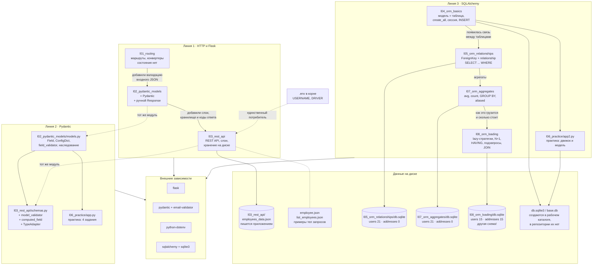

# Индекс проектов и схема связей

Учебный репозиторий курса по Flask. Каждый каталог — отдельное занятие, названное по номеру
занятия (в хронологическом порядке) и теме.
Проекты **независимы**: ни один из них не импортирует другой, общего кода и общей базы нет.
Связывает их только линия обучения — каждая следующая тема опирается на предыдущую.

Подробная схема каждого проекта лежит рядом с его кодом, в файле `SCHEMA.md`.

## Индекс

| Каталог | Тема занятия | Стек | Тип | Точка входа | Схема |
|---|---|---|---|---|---|
| `l01_routing` | маршрутизация, конвертеры путей | Flask | веб-сервер | `python l01_routing/app.py` | [SCHEMA](l01_routing/SCHEMA.md) |
| `l02_pydantic_models` | Pydantic: модели, валидаторы, `Response` | Flask + Pydantic | веб-сервер | `cd l02_pydantic_models && python app.py` | [SCHEMA](l02_pydantic_models/SCHEMA.md) |
| `l03_rest_api` | REST API «сотрудники», слои, хранение в JSON | Flask + Pydantic + dotenv | **REST API** | `python -m l03_rest_api.app` | [SCHEMA](l03_rest_api/SCHEMA.md) |
| `l04_orm_basics` | первые модели ORM, 3 способа маппинга | SQLAlchemy | скрипт | `python l04_orm_basics/app_1.py` (и `app_2.py`) | [SCHEMA](l04_orm_basics/SCHEMA.md) |
| `l05_orm_relationships` | `relationship` 1:M, фильтры `WHERE` | SQLAlchemy | скрипт | `cd l05_orm_relationships && python app.py` | [SCHEMA](l05_orm_relationships/SCHEMA.md) |
| `l06_practice` | практика: 4 задания Pydantic + 2 SQLAlchemy | Pydantic, SQLAlchemy | скрипт | `python l06_practice/app.py` (и `app2.py`) | [SCHEMA](l06_practice/SCHEMA.md) |
| `l07_orm_aggregates` | агрегаты, `GROUP BY`, `aliased` | SQLAlchemy | скрипт | `cd l07_orm_aggregates && python app.py` | [SCHEMA](l07_orm_aggregates/SCHEMA.md) |
| `l08_orm_loading` | стратегии `lazy`, N+1, `HAVING`, подзапросы | SQLAlchemy | скрипт | `cd l08_orm_loading && python app.py` | [SCHEMA](l08_orm_loading/SCHEMA.md) |

Flask есть только в первых трёх проектах. Начиная с 08.09 занятия про базу данных, и веб-слоя
в них нет вообще — это обычные скрипты, которые выполняются сверху вниз и завершаются.

## Схема связей

## Кто чем связан на самом деле

| Вопрос | Ответ |
|---|---|
| Импортируют ли проекты друг друга? | **Нет.** Ни одного межпроектного импорта. Единственные внутренние импорты — внутри `l02_pydantic_models` (`app.py → models.py`) и внутри `l03_rest_api` (`app.py → schemas.py → utils.py → settings.py`) |
| Общая база данных? | **Нет.** Три отдельных файла `db.sqlite` в трёх каталогах. У `l08_orm_loading` вдобавок **другая схема**: `users.name` вместо `username`, `addresses.city` вместо `description` |
| Общий файл конфигурации? | Корневой `.env` читает только `l03_rest_api` |
| Общий код между линиями? | Нет, каждая тема начинается с нуля. Модели `User`/`Address` объявлены заново в четырёх файлах |

## Сводка: вход и выход

| Проект | Вход | Выход |
|---|---|---|
| `l01_routing` | только путь URL | `text/html`, строка |
| `l02_pydantic_models` | путь URL; JSON для `/` зашит в код | `application/json` + `text/html` |
| `l03_rest_api` | тело HTTP-запроса (JSON), `.env` | `application/json`, коды `200/201/400`; запись в `employees_data.json` |
| `l04_orm_basics` | данные зашиты в код | файл SQLite + SQL-лог в консоли |
| `l05_orm_relationships` | `db.sqlite`; параметры запросов зашиты в код | stdout, базу не меняет |
| `l06_practice` | значения зашиты в код | stdout (`app.py`); `app2.py` не выводит ничего |
| `l07_orm_aggregates` | `db.sqlite` | stdout, базу не меняет |
| `l08_orm_loading` | `db.sqlite` | stdout + весь SQL (`echo=True`), базу не меняет |

Данные извне принимает **только `l03_rest_api`**. У остальных вход зашит в исходник либо
лежит в файле БД рядом.

## Общие грабли: рабочий каталог

Во всех проектах пути относительные, а значит разрешаются от **текущего каталога процесса**,
а не от расположения файла. Запуск не из того каталога не выдаёт ошибку — он молча создаёт
пустую базу или пишет JSON не туда.

| Проект | Откуда запускать | Почему |
|---|---|---|
| `l02_pydantic_models` | из каталога проекта | абсолютный импорт `from models import User` |
| `l03_rest_api` | из корня репозитория | относительные импорты пакета + `DATA_FILE = "l03_rest_api/..."` |
| `l05_orm_relationships`, `l07_orm_aggregates`, `l08_orm_loading` | из каталога проекта | готовый `db.sqlite` лежит внутри каталога |
| `l01_routing`, `l04_orm_basics`, `l06_practice` | откуда угодно | файлов данных не читают (БД создадут в текущем каталоге) |

Имена всех каталогов — корректные идентификаторы Python, поэтому импорт вида
`import l07_orm_aggregates.app` работает для любого из них. Это, однако, не отменяет требований
к рабочему каталогу из таблицы выше: пути к `db.sqlite` и к JSON остаются относительными.

## Что ещё есть в репозитории

* **`.github/workflows/main.yml`** — workflow «Сохранить урок преподавателя». Запускается вручную
  с вкладки Actions, создаёт в этом репозитории ветку `teacher/<метка времени UTC>` со снимком
  ветки `main` репозитория преподавателя (`cpython-projects/060326-flask`). К коду уроков
  отношения не имеет — это инструмент архивации.
* **`.env`** — `USERNAME` и `DRIVER`. Читается только в `l03_rest_api/app.py`, причём под
  другим именем (`DB_USERNAME`), то есть сейчас туда приходит `None`.
* **`.idea/`** — настройки PyCharm, в том числе подключённые источники данных.

## Как смотреть эти схемы

Диаграммы написаны на **Mermaid** — в блоках кода с языком `mermaid`.

* **PyCharm** — плагин *Mermaid* (JetBrains) уже входит в сборку 2026.2.1 и включён.
  Откройте любой `SCHEMA.md` и включите предпросмотр Markdown: кнопка в правом верхнем углу
  редактора либо `Ctrl+Shift+A` → `Markdown Preview`.
* **GitHub** — рендерит Mermaid в `.md` сам, ничего включать не нужно.
