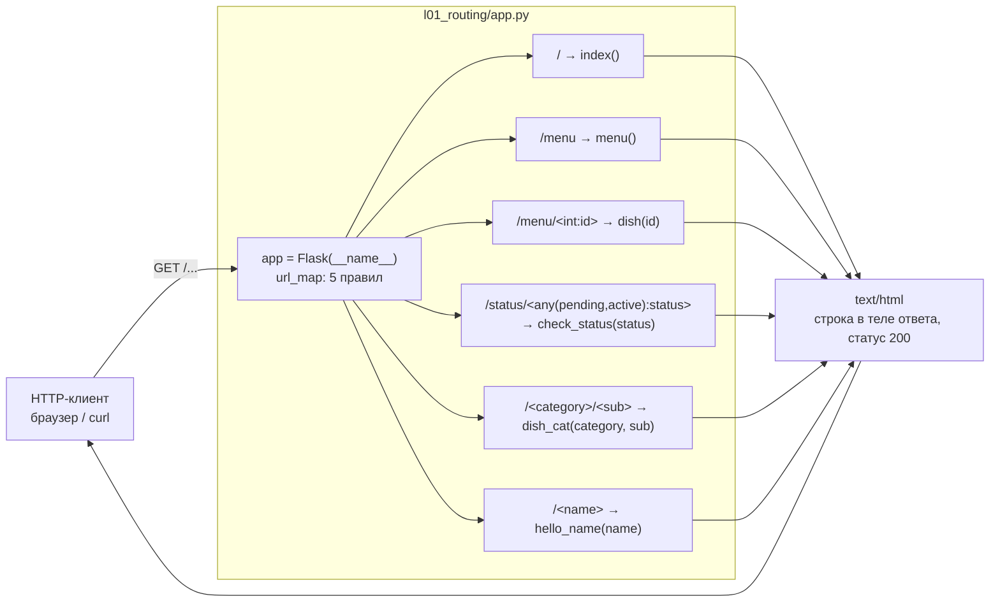

# l01_routing — схема проекта

## Что это

Самый первый, «скелетный» пример Flask. Никакой бизнес-логики, никакого хранилища, никаких
зависимостей кроме самого Flask. Единственная тема урока — **маршрутизация**: как URL
превращается в вызов Python-функции и как работают конвертеры путей (`int`, `any`, `string`).

Приложение — один файл `app.py`, ни импортов из проекта, ни файлов данных.

## Точка входа и запуск

```
cd l01_routing
python app.py
```

`app.run()` без аргументов → сервер на `http://127.0.0.1:5000`, `debug` выключен.
Данных на диске проект не читает и не пишет, но правило запуска изнутри каталога
единое для всех уроков курса.

## Схема



## Вход / Выход

| Маршрут | Метод | Вход | Выход (200, `text/html`) |
|---|---|---|---|
| `/` | GET | — | `Index Page` |
| `/menu` | GET | — | `Menu Page` |
| `/menu/<int:id>` | GET | `id` — только цифры, приходит как `int` | `Dish id is 5` |
| `/status/<any(pending, active):status>` | GET | `status` ∈ {`pending`, `active`} | `Status is active` |
| `/<category>/<sub>` | GET | два сегмента без `/` внутри | `Dish category is: fish and sub is soup` |
| `/<name>` | GET | один сегмент | `Hello, Viktor!` |

Тело запроса нигде не читается: единственный источник входных данных — путь URL.
Ничего не пишется ни на диск, ни в БД — состояния у приложения нет.

## Связи

Их нет. Файл ничего не импортирует из проекта, не читает файлов, не ходит в сеть.
Внешняя зависимость одна — `flask`.

## Особенности

* **Конкуренция маршрутов.** `/menu` и `/<name>` совпадают по форме, но Werkzeug сортирует
  правила по специфичности, а не по порядку объявления: статический `/menu` выигрывает.
  Так же `/menu/7` уходит в `dish()`, а не в `dish_cat()` — конвертер `int` специфичнее
  дефолтного `string`.
* `/menu/abc` даст **404**, а не вызов `dish()`: конвертер `int` просто не совпадает.
* `/a/b/c` не совпадёт ни с одним правилом — дефолтный конвертер `string` не пропускает `/`.
* Маршрут `/events` в этом уроке ещё не объявлен — он появляется только в
  [`l02_pydantic_models/app.py`](../l02_pydantic_models/SCHEMA.md). Раньше комментарий в коде
  упоминал его как существующий; сейчас текст приведён в соответствие с кодом.
* `app.run()` поднимает отладочный сервер Werkzeug. Для продакшена нужен WSGI-сервер
  (gunicorn/uwsgi) — встроенный на это не рассчитан.
