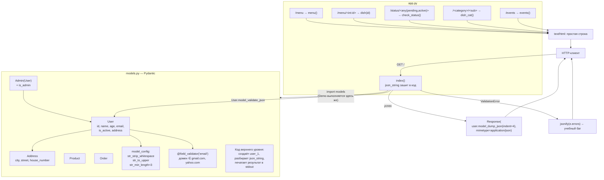

# l02_pydantic_models — схема проекта

## Что это

Первое знакомство с **Pydantic v2**: описание моделей, ограничения полей, вложенные модели,
собственные валидаторы, наследование — и ручная отдача `Response` из Flask.

Проект состоит из двух модулей: `models.py` (модели + демонстрационный код, выполняющийся
при импорте) и `app.py` (Flask поверх них). Постоянного хранилища нет — «входные данные»
зашиты в исходник как строка JSON.

## Точка входа и запуск

```
cd l02_pydantic_models
python app.py
```

Запускать нужно **из каталога `l02_pydantic_models`**: в `app.py` стоит абсолютный импорт
`from models import User`, а не `from .models import User`. Из корня проекта модуль `models`
не найдётся.

`app.run(debug=True)` → `http://127.0.0.1:5000` с автоперезагрузкой и отладочной страницей ошибок.

## Схема



## Вход / Выход

| Маршрут | Вход | Выход |
|---|---|---|
| `/` | **ничего от клиента** — JSON зашит в тело функции `index()` | `application/json`: сериализованный `User` с `age`, увеличенным на 10 |
| `/menu` | — | `Menu of MyCafe` |
| `/menu/<int:id>` | `id` как `int` | `Dish id is 5` |
| `/status/<any(pending, active):status>` | `status` ∈ {`pending`, `active`} | `status is active` |
| `/<category>/<sub>` | два сегмента пути | `Dish category is fish and sub is soup` |
| `/events` | — | `Events of MyCafe` |

Побочный выход: `models.py` при импорте печатает в **stdout сервера** результат своей
демонстрации (см. ниже), а `index()` дополнительно печатает туда же `print(user)`.

### Что делает Pydantic на входе (`strict=False`)

| Поле в JSON | Значение | После валидации | Почему |
|---|---|---|---|
| `age` | `22.0` (float) | `22` (int) | нестрогий режим допускает `float → int` без потерь |
| `is_active` | `0` (int) | `False` | нестрогий режим допускает `int → bool` |
| `name` | `"John Doe"` | `"JOHN DOE"` | `str_to_upper=True` из `model_config` |
| `address` | вложенный объект | экземпляр `Address` | вложенная модель |

## Связи

```
app.py  ──import──▶  models.py  ──▶  pydantic
   │
   └──▶ flask (Flask, jsonify, Response)
```

Внешние зависимости: `flask`, `pydantic`, `email-validator` (нужен для `EmailStr`).
Файлов данных и БД нет. `__init__.py` пустой — только маркер пакета.

## Особенности и учебные баги

* **`jsonify(e.errors)` в ветке `except`** — `errors` это метод, а не свойство. Без скобок в
  `jsonify` попадёт сам объект метода и обработчик упадёт с `TypeError`. Правильно:
  `jsonify(e.errors())`.
* **Демонстрационный код в `models.py` выполняется при импорте.** Строка `json_string` в
  `models.py` содержит `john.doe@example.com`, а валидатор `check_email` разрешает только
  `gmail.com` и `yahoo.com` → при импорте в stdout уйдёт `ValidationError: ...`. На запуск
  Flask это не влияет (исключение поймано), но сам приём — код верхнего уровня в модуле
  моделей — в рабочем проекте так делать не стоит.
* **`user.age += 10` не проверяется.** По умолчанию `validate_assignment` выключен, поэтому
  ограничение `le=70` при присваивании не срабатывает, и в ответе может оказаться возраст
  вне заявленного диапазона.
* **`str_min_length=3` не распространяется на `Address`.** Это настройка `model_config`
  модели `User`, а вложенная модель имеет собственную конфигурацию — поэтому `city='NY'`
  (2 символа) проходит.
* Закомментированный валидатор `check_name` (требование `istitle()`) несовместим с
  `str_to_upper=True`: `"JOHN".istitle()` → `False`.
* `List` из `typing` импортирован, но не используется; `ValidationError`/`HttpUrl` в
  `models.py` нужны только `Product` и блоку демонстрации.
