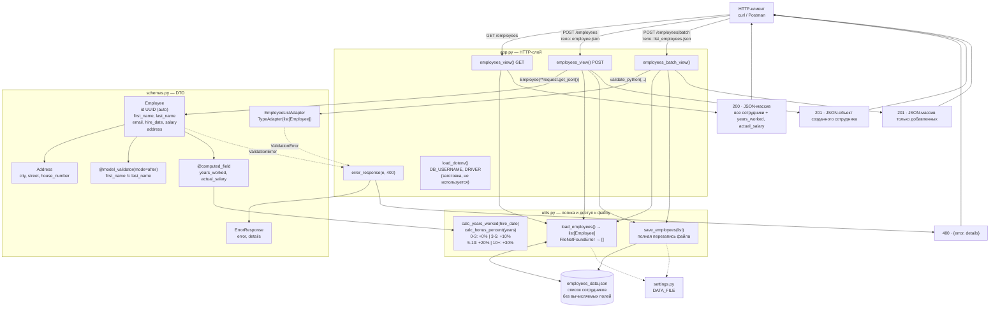

# l03_rest_api — схема проекта

## Что это

Единственный в репозитории **законченный REST API**: приём и отдача JSON, валидация через
Pydantic, слой бизнес-логики и «база данных» в виде JSON-файла. Предметная область — сотрудники:
хранится базовая карточка, а стаж и зарплата с надбавкой считаются на лету при каждой отдаче.

Проект разложен по слоям — это его главное отличие от остальных уроков:

| Файл | Роль |
|---|---|
| `app.py` | HTTP-слой: маршруты, разбор запроса, коды ответа |
| `schemas.py` | DTO: форма данных на границе (`Employee`, `Address`, `ErrorResponse`) |
| `utils.py` | Бизнес-логика (стаж, бонус) + чтение/запись файла-«БД» |
| `settings.py` | Конфигурация: путь к файлу данных |
| `employees_data.json` | Само хранилище (перезаписывается приложением) |
| `employee.json`, `list_employees.json` | Готовые тела запросов для ручной проверки |

## Точка входа и запуск

```
cd l03_rest_api
python app.py
```

Запускать **из каталога проекта**, как и остальные уроки:

* модули импортируют друг друга абсолютно (`from schemas import ...`); это работает потому,
  что Python кладёт каталог запускаемого скрипта в `sys.path`;
* `DATA_FILE = "employees_data.json"` — путь относительный и разрешается от текущего рабочего
  каталога, а не от расположения `settings.py`. Запуск из корня репозитория ошибки не даст:
  приложение молча создаст пустой `employees_data.json` там, откуда его запустили.

Альтернатива для отладки, из того же каталога: `python -m flask --app app run --debug`.

## Схема



## Вход / Выход

| Маршрут | Метод | Вход | Успех | Ошибка |
|---|---|---|---|---|
| `/employees` | GET | — | `200` + массив всех сотрудников | — |
| `/employees` | POST | один объект сотрудника (JSON) | `201` + созданный объект с `id` | `400` + `{error, details}` |
| `/employees/batch` | POST | массив объектов (JSON) | `201` + массив добавленных | `400`, весь запрос отклоняется целиком |

`request.get_json(force=True)` — тело разбирается как JSON даже без заголовка
`Content-Type: application/json`.

### Что клиент присылает (`employee.json`)

```json
{
  "first_name": "Elena",
  "last_name": "Petrova",
  "email": "elena.petrova@company.com",
  "hire_date": "2012-06-01",
  "salary": 80000,
  "address": { "city": "Antalya", "street": "Ataturk Ave", "house_number": "45B" }
}
```

`id` клиент не присылает — он генерируется `default_factory=uuid4`.

### Что API возвращает

Те же поля **плюс** `id` и два вычисляемых поля:

| Поле | Откуда |
|---|---|
| `years_worked` | `calc_years_worked(hire_date)` — полных лет на сегодня |
| `actual_salary` | `salary * (1 + calc_bonus_percent(years_worked))`, округлено до 2 знаков |

### Что реально лежит в файле

`save_employees` вызывает `model_dump(mode="json", exclude={"years_worked", "actual_salary"})`.
То есть вычисляемые поля в `employees_data.json` **не хранятся** — они пересчитываются при
каждом ответе и всегда актуальны на текущую дату. `mode="json"` нужен, чтобы `UUID` и `date`
превратились в строки: иначе `json.dump` упал бы с `TypeError`.

### Проверка правил валидации

| Правило | Где задано | Что отвергается |
|---|---|---|
| `first_name`, `last_name` 2–50 символов | `Field(min_length, max_length)` | слишком короткие/длинные |
| корректный email | `EmailStr` | строка без `@`, неверный домен |
| `salary > 0` | `Field(gt=0)` | 0 и отрицательные |
| `first_name != last_name` | `@model_validator(mode="after")` | `Ivan Ivan`, в том числе `ivan IVAN` |
| пробелы по краям строк обрезаются | `ConfigDict(str_strip_whitespace=True)` | — (это нормализация, а не отказ) |

## Связи

```
app.py ──▶ schemas.py ──▶ utils.py ──▶ settings.py ──▶ employees_data.json
   │            │
   │            └── pydantic (BaseModel, TypeAdapter, computed_field, model_validator)
   ├──▶ utils.py (load_employees, save_employees)
   ├──▶ flask (Flask, Response, request)
   └──▶ python-dotenv (load_dotenv) ──▶ .env в корне проекта
```

**Циклический импорт** между `schemas.py` и `utils.py` разорван вручную: `utils.py` импортирует
`Employee` не наверху файла, а **внутри** функции `load_employees()`.

Внешние зависимости: `flask`, `pydantic`, `email-validator`, `python-dotenv`.

## Особенности

* **`.env`: ключ переименован в `DB_USERNAME`.** Раньше в `.env` лежал `USERNAME`, а код читал
  `DB_USERNAME` — в переменную приходил `None`. Исправлено в сторону кода, и намеренно:
  `USERNAME` на Windows уже занят системой (там имя пользователя ОС), а `load_dotenv()` по
  умолчанию **не перезаписывает** существующие переменные окружения (`override=False`).
  То есть значение из `.env` было бы молча проигнорировано, и в переменную попало бы имя
  пользователя Windows — без единой ошибки. Отсюда правило: давать ключам в `.env` префикс
  проекта или подсистемы.
* Сама переменная дальше пока не используется: `conn_str = f'{DRIVER}'` — заготовка на будущий
  урок с настоящей БД.
* **Запись не атомарна и не потокобезопасна.** Каждый POST читает файл целиком, дописывает в
  память и перезаписывает файл в режиме `"w"`. Два одновременных запроса потеряют одну из
  записей. Для учебного примера нормально, для рабочего — нет.
* **Нет операций чтения одного, обновления и удаления.** Реализованы только список и создание;
  `GET /employees/<id>`, `PUT`, `DELETE` отсутствуют.
* **`details: list = []` в `ErrorResponse`** выглядит как классическая ошибка с общим
  изменяемым значением по умолчанию, но здесь безопасно: Pydantic делает копию для каждого
  экземпляра.
* **`EmployeeListAdapter` создан один раз на уровне модуля** — `TypeAdapter` кэширует
  скомпилированную схему, пересоздавать его в каждом запросе было бы дорого.
* `list_employees.json` содержит сотрудников с разным стажем (2010, 2019, 2024 годы) — удобно,
  чтобы увидеть все ступени бонуса сразу.
