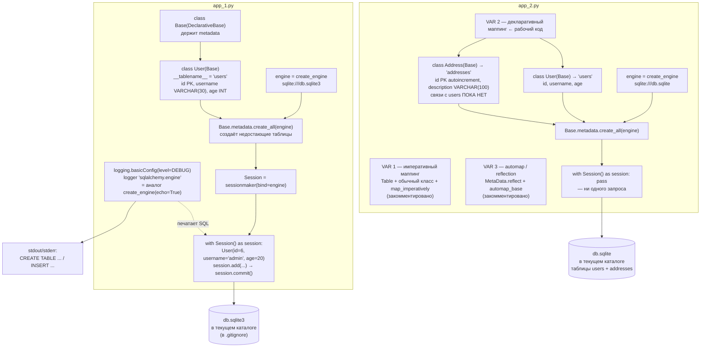

# l04_orm_basics — схема проекта

## Что это

Первое знакомство с **SQLAlchemy ORM**. Flask здесь уже нет: оба файла — обычные скрипты,
которые выполняются сверху вниз и завершаются. HTTP-входа нет, вход у них — сам исходный код,
выход — SQL-лог в консоли и файл SQLite на диске.

| Файл | Тема |
|---|---|
| `app_1.py` | декларативная модель, создание таблиц, сессия, вставка одной записи, логирование SQL |
| `app_2.py` | три способа связать Python-класс с таблицей БД (два из трёх — закомментированы) |

## Точка входа и запуск

```
cd l04_orm_basics
python app_1.py
python app_2.py
```

Строки подключения относительные (`sqlite:///db.sqlite3` у `app_1.py` и `sqlite:///db.sqlite`
у `app_2.py`), поэтому файлы БД создаются **в текущем рабочем каталоге процесса**, а не рядом
со скриптом. При запуске изнутри каталога они появятся здесь же. Обе базы генерируются с нуля
и в репозиторий не попадают — занесены в `.gitignore`. Это отличает их от готовых `db.sqlite`
в `l05`/`l07`/`l08`, которые лежат в git специально, с данными для запросов.

`app_1.py` можно запускать многократно: каждый запуск добавляет ещё одного пользователя
с новым автоинкрементным `id`.

## Схема



## Вход / Выход

| Скрипт | Вход | Выход |
|---|---|---|
| `app_1.py` | ничего извне — данные зашиты в код: `User(id=6, username='admin', age=20)` | файл `db.sqlite3` с таблицей `users` и одной строкой; SQL-лог в консоли |
| `app_2.py` | ничего | файл `db.sqlite` с пустыми таблицами `users` и `addresses`; лога нет — логирование не настроено |

Сессия в `app_2.py` открывается и сразу закрывается (`pass`): цель урока — только факт создания
таблиц.

## Связи

Между `app_1.py` и `app_2.py` связи нет — это два независимых скрипта, у каждого свой `Base`,
свой `engine` и свой файл БД. Друг друга они не импортируют.

Внешние зависимости: `sqlalchemy` (и драйвер `sqlite3` из стандартной библиотеки).

## Особенности

* **Явный первичный ключ ломал повторный запуск — исправлено.** Было `User(id=6, ...)`:
  первый запуск проходил, второй падал с `IntegrityError` (`UNIQUE constraint failed:
  users.id`). Коварство в том, что «первый раз всё получилось», и проблема вылезает позже.
  Сейчас `id` не указывается вовсе, SQLite подставляет следующий свободный номер сам, и
  скрипт можно запускать сколько угодно раз. Неправильный вариант оставлен в коде
  закомментированным.
* **`create_all` только создаёт недостающие таблицы.** Существующие он не изменяет: добавили
  поле в модель — в БД оно не появится. Для миграций нужен Alembic.
* **`add()` не выполняет SQL.** Он лишь помечает объект как новый в сессии; INSERT уходит в базу
  на `commit()`. Без `commit()` выход из блока `with` откатит всё.
* **Два способа включить SQL-лог эквивалентны**: `logging` с уровнем DEBUG для логгера
  `sqlalchemy.engine` (как здесь) либо `create_engine(..., echo=True)` (как в `l08_orm_loading/app.py`).
  Уровень DEBUG показывает и запрос, и его параметры; INFO — только запрос.
* **VAR 3 (automap) достаёт класс по имени ТАБЛИЦЫ, а не класса**: `Base.classes.users`. Удобно
  для чужой/легаси-базы, но IDE не знает про поля — подсказок типов нет.
* Старый синтаксис `Column(Integer, primary_key=True)` оставлен в комментариях рядом с
  `Mapped[int] = mapped_column(...)`. Результат в БД одинаковый, разница только в подсказках
  типов для IDE и mypy.
* `Address` здесь ещё без `ForeignKey` — внешний ключ и `relationship` появляются в
  [`l05_orm_relationships`](../l05_orm_relationships/SCHEMA.md).
