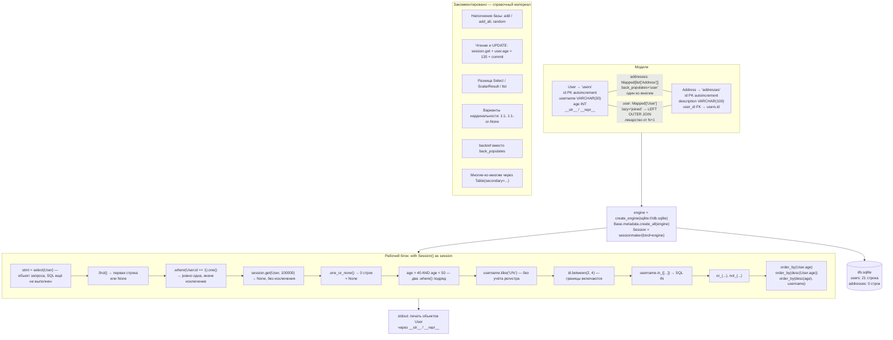

# l05_orm_relationships — схема проекта

## Что это

Скрипт (не веб-приложение) про **связи между таблицами** и **выборку данных**:
`relationship` + `ForeignKey` для связи один-ко-многим, и большой блок примеров
`select().where(...)` — операторы сравнения, `ilike`, `between`, `in_`, `and_/or_/not_`,
`order_by`.

Flask здесь не используется. Вход — база данных, выход — печать в консоль.

## Точка входа и запуск

```
cd l05_orm_relationships
python app.py
```

`create_engine('sqlite:///db.sqlite')` — путь относительный, разрешается от текущего рабочего
каталога. Готовый файл `db.sqlite` лежит **внутри** `l05_orm_relationships/`, поэтому запускать нужно
из этого каталога — иначе SQLAlchemy создаст пустую базу в другом месте и первый же
`print(user_first.id, ...)` упадёт (см. «Особенности»).

## Схема



## Вход / Выход

| | |
|---|---|
| **Вход** | файл `db.sqlite` (21 пользователь, 0 адресов). Параметры запросов зашиты в код: `id == 1`, `age > 40`, `ilike('U%')`, список имён `['username6132', 'username9452', 'username4585']` и т. д. |
| **Выход** | только печать в stdout. Базу скрипт **не изменяет** — блоки со вставкой и обновлением закомментированы. `create_all` в худшем случае досоздаст недостающие таблицы. |

## Три способа выполнить один и тот же `select`

| Вызов | Что вернёт |
|---|---|
| `session.scalars(stmt)` | ленивый `ScalarResult` — итератор по объектам `User` |
| `session.scalars(stmt).all()` | обычный `list[User]` |
| `session.execute(stmt).all()` | список `Row` (кортежей), а не объектов |

И четыре способа взять «одну» строку — разница именно в поведении на 0 и на 2+ строках:

| Вызов | 0 строк | 1 строка | 2+ строк |
|---|---|---|---|
| `.first()` | `None` | объект | первый объект |
| `.one()` | `NoResultFound` | объект | `MultipleResultsFound` |
| `.one_or_none()` | `None` | объект | `MultipleResultsFound` |
| `session.get(User, pk)` | `None` | объект | — (поиск только по PK) |

## Связи

Модули проекта друг друга не импортируют — весь код в одном `app.py`, `__init__.py` пустой.
Внешняя зависимость одна — `sqlalchemy`. Единственная внешняя связь — файл `db.sqlite`.

Схема БД в этом файле совпадает со схемой в [`l07_orm_aggregates`](../l07_orm_aggregates/SCHEMA.md) (те же `users`
и `addresses` с `description`), но **отличается** от [`l08_orm_loading`](../l08_orm_loading/SCHEMA.md), где
у `User` поле `name` вместо `username`, а у `Address` — `city` вместо `description`. Это разные
файлы БД в разных каталогах, они не пересекаются.

## Особенности

* **Результат выборки без проверки — исправлено.** Раньше шло `user_first.id` сразу после
  `.first()`: на наполненной базе это работает и выглядит правильно, но `.first()` на пустой
  таблице возвращает `None`, и следующая строка падает с
  `AttributeError: 'NoneType' object has no attribute 'id'`. Сейчас результат проверяется
  через `if`. Для `.one()` проверка на `None` не годится — он не возвращает `None`, а бросает
  `NoResultFound`, поэтому там `try/except`. Неправильные варианты оставлены в коде
  закомментированными.
* **`==` внутри `.where()` — это не сравнение Python**, а построение SQL-условия `id = 1`.
  Результат — объект выражения, а не `True`/`False`. По той же причине нельзя писать питоновские
  `and` / `or` / `not`: они требуют привести операнд к `bool`, а SQLAlchemy 2.0 на это отвечает
  `TypeError: Boolean value of this clause is not defined`. Нужны `and_()`, `or_()`, `not_()`
  либо несколько `.where()` подряд.
* **`.where()` возвращает новый объект запроса**, исходный `stmt` не меняется — поэтому один и
  тот же `stmt` переиспользуется во всём блоке.
* **Два `.where()` подряд склеиваются через `AND`.**
* **`in_()` с подчёркиванием** — потому что `in` зарезервированное слово в Python.
* **`lazy='joined'` у `Address.user`** тянет связанного пользователя сразу тем же запросом
  (LEFT OUTER JOIN). Альтернативная стратегия — `lazy='selectin'` — разобрана в
  [`l08_orm_loading`](../l08_orm_loading/SCHEMA.md).
* **Таблица `addresses` пуста** (0 строк), поэтому связь `relationship` в этом запуске никак не
  проявляется — она объявлена, но данных для неё нет.
* Неиспользуемые импорты `func` и `and_` удалены: агрегаты начинаются в
  [`l07_orm_aggregates`](../l07_orm_aggregates/SCHEMA.md), а `AND` в запросах этого урока
  получается сам — два `.where()` подряд склеиваются через него. `Optional` и `random`
  оставлены: они нужны закомментированным учебным блокам.
