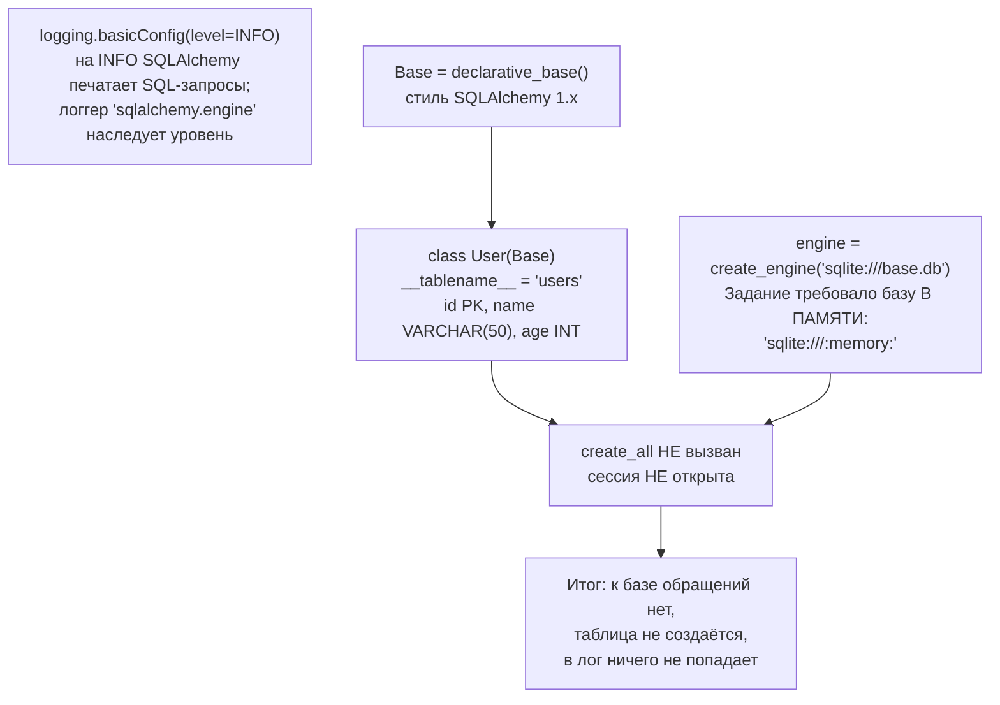

# l06_practice — схема проекта

## Что это

Практические задания к уроку 09.09.26 — два независимых скрипта, не связанных друг с другом:

| Файл | Тема | Заданий |
|---|---|---|
| `app.py` | модели Pydantic: валидаторы, `Field`, `Literal`, `ConfigDict` | 4 |
| `app2.py` | SQLAlchemy: движок, логирование SQL, модель `User` | 2 |

Ни Flask, ни HTTP здесь нет. Оба файла выполняются сверху вниз, «вход» зашит в код,
«выход» — печать в консоль.

Условия заданий: <https://lms.itcareerhub.de/pluginfile.php/20091/mod_resource/content/1/Django_Pr2.pdf>

## Точка входа и запуск

```
python l06_practice/app.py
python l06_practice/app2.py
```

`app2.py` создаёт файл `base.db` в текущем рабочем каталоге — точнее, **должен был бы**:
фактически он к базе не обращается вообще (см. «Особенности»).

## Схема — app.py (Pydantic)

```mermaid
flowchart TB
    subgraph T1["Задание 1 — Event"]
        E["Event<br/>title: str<br/>date: datetime<br/>location: str"]
        EV["@field_validator('date')<br/>value < datetime.now() → ValueError<br/>'Дата события не может быть в прошлом'"]
        E --> EV
        ET["Проверка: date = now + 30 дней<br/>try/except ValueError → print"]
        EV --> ET
    end

    subgraph T2["Задание 2 — UserProfiles"]
        U["UserProfiles<br/>username: str<br/>password: str<br/>email: EmailStr"]
        UC["model_config = ConfigDict(<br/>str_strip_whitespace=True,<br/>str_min_length=2)"]
        UF["password: Field(..., min_length=8)<br/>строже общего str_min_length"]
        U --> UC
        U --> UF
        UT["user_profile2 = ('user2', '12345678', ...)<br/>→ print<br/>вариант с '12345' закомментирован"]
        UF --> UT
    end

    subgraph T3["Задание 3 — Transaction"]
        TR["Transaction<br/>amount: float Field(gt=0)<br/>currency: str max_length=3<br/>transaction_type: Literal['debit','credit']<br/>timestamp: datetime"]
        TT["transaction = (100.50, 'USD', 'credit', now)<br/>→ print"]
        TR --> TT
    end

    subgraph T4["Задание 4 — Appointment — НЕ ЗАВЕРШЕНО"]
        AP["Appointment<br/>appointment_date: datetime<br/>patient_name: str<br/>doctor_name: str"]
        AV["@field_validator('appointment_date')<br/>объявлен на уровне МОДУЛЯ,<br/>а не в теле класса<br/>→ Pydantic его не видит,<br/>модель принимает любую дату"]
        AP -.->|"связи нет<br/>из-за отступа"| AV
    end

    T1 --> Out["stdout: печать созданных моделей"]
    T2 --> Out
    T3 --> Out
```



## Схема — app2.py (SQLAlchemy)



## Вход / Выход

| Скрипт | Вход | Выход |
|---|---|---|
| `app.py` | значения зашиты в код: `now + 30 дней`, `('user2', '12345678', 'user@example.com')`, `(100.50, 'USD', 'credit', now)` | три строки в stdout — представления `Event`, `UserProfiles`, `Transaction` |
| `app2.py` | ничего | ничего: ни файла, ни лога |

## Связи

`app.py` и `app2.py` друг друга не импортируют и общих данных не имеют. `__init__.py` пустой.

Внешние зависимости: `pydantic`, `email-validator` (для `EmailStr`), `sqlalchemy`.

## Особенности и незакрытые задания

* **Задание 4 не работает.** Декоратор `@field_validator('appointment_date')` и функция
  `appointment_date_validator` стоят на уровне модуля, а не внутри класса `Appointment`.
  Pydantic собирает валидаторы только из тела класса, поэтому проверка никогда не вызывается и
  модель принимает любую дату, в том числе прошедшую. Починка — сдвинуть декоратор и функцию на
  один уровень отступа внутрь класса. Заодно условие в ней строже задания: требуется не просто
  «в будущем», а минимум за 24 часа.
* **Задание из `app2.py` выполнено не до конца.** Требовалась база в памяти
  (`sqlite:///:memory:`) и вывод логов всех операций. Указан файл `base.db`, а операций нет
  вовсе: без `Base.metadata.create_all(engine)` и без открытой сессии движок к базе не
  подключается — `create_engine` соединение не открывает, он только настраивает пул.
  Поэтому в лог ничего не пишется.
* **`except ValueError` в задании 1 ловит и `ValidationError`** — она наследник `ValueError`.
* **`DECIMAL` из SQLAlchemy импортирован в `app.py`, но не используется** — импорт лишний.
  Замечание в комментарии верное: для денег `float` неточен (`0.1 + 0.2 != 0.3`), в рабочем коде
  берут `decimal.Decimal`.
* **`datetime.now()` — наивное время без часового пояса.** Сравнение наивной даты с aware-датой
  бросит `TypeError`. В задании 4 это учтено (`datetime.now(value.tzinfo)`), в задании 1 — нет.
* **Внутренний класс `ConfigDict` в `UserProfiles` был бы проигнорирован**: старый способ
  требует имя `Config`. Актуальный вариант — атрибут `model_config`, он и используется.
* **`declarative_base()` в `app2.py` — стиль 1.x.** В остальных файлах проекта используется
  класс `DeclarativeBase` из SQLAlchemy 2.0; результат одинаковый, но 2.0-стиль предпочтителен.
