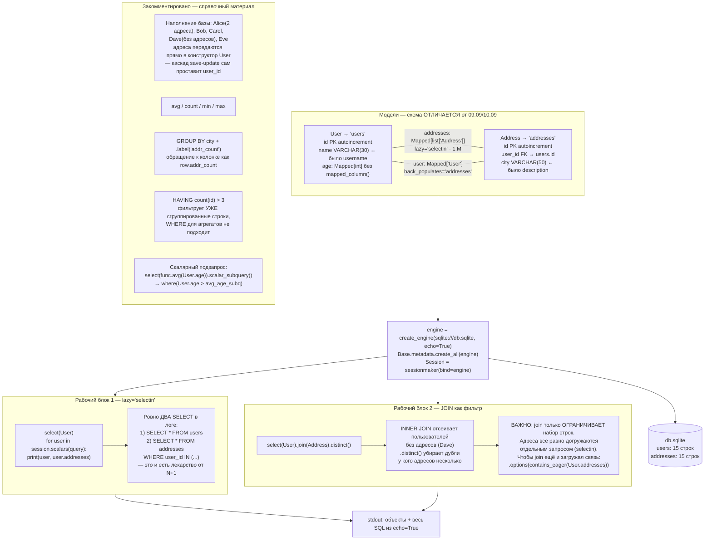

# l08_orm_loading — схема проекта

## Что это

Урок про **стратегии загрузки связей** и проблему **N+1 запросов**, плюс справочный блок с
`HAVING`, агрегатами и подзапросами. Ключевая деталь: `echo=True` у движка — весь смысл урока в
том, чтобы **увидеть в логе, сколько именно запросов уходит в базу**.

Flask не используется. Вход — база данных, выход — печать в консоль (объекты + SQL-лог).

## Точка входа и запуск

```
cd l08_orm_loading
python app.py
```

Имя каталога — корректный идентификатор Python, поэтому `import l08_orm_loading.app` возможен,
но файл рассчитан на прямой запуск.
`create_engine('sqlite:///db.sqlite', echo=True)` — путь относительный, готовый `db.sqlite`
лежит внутри `l08_orm_loading/`, поэтому запускать нужно из этого каталога.

## Схема



## Вход / Выход

| | |
|---|---|
| **Вход** | файл `db.sqlite` (15 пользователей, 15 адресов). Параметров у запросов нет |
| **Выход** | stdout: для каждого пользователя — его строка и список адресов; плюс **весь SQL** из-за `echo=True`. Базу скрипт не изменяет — блок наполнения закомментирован |

Пример строки вывода: `User: Alice; 30 [Address: New York, Address: Los Angeles]`.

## Стратегии загрузки — сравнение по репозиторию

| Стратегия | Где в проекте | Сколько запросов на N пользователей | Как выглядит |
|---|---|---|---|
| `lazy='select'` (по умолчанию) | — | **1 + N** — проблема N+1 | отдельный SELECT на каждое обращение к `.addresses` |
| `lazy='joined'` | [`l05_orm_relationships`](../l05_orm_relationships/SCHEMA.md), [`l07_orm_aggregates`](../l07_orm_aggregates/SCHEMA.md) | **1** | один запрос с LEFT OUTER JOIN |
| `lazy='selectin'` | **этот файл** | **2** | SELECT по users + SELECT по addresses с `WHERE user_id IN (...)` |

## Связи

Импортов из проекта нет — весь код в одном `app.py`. Внешняя зависимость — `sqlalchemy`.
Единственная внешняя связь — файл `db.sqlite` в том же каталоге.

**Схема БД здесь другая**, чем в уроках 09.09 и 10.09: у `User` поле `name` (а не `username`),
у `Address` — `city` (а не `description`). Это отдельный файл БД в отдельном каталоге, с
базами соседних уроков он не пересекается.

## Особенности

* **`age: Mapped[int]` без вызова `mapped_column()`** — тип колонки выводится прямо из
  аннотации. Вызов нужен только когда требуются параметры (`primary_key`, длина, `ForeignKey`).
* **Вторая сессия открывается специально.** У новой сессии пустой identity map, поэтому запросы
  блока 2 действительно уходят в базу, а не берутся из кэша первой сессии — иначе в логе было бы
  не видно, что происходит.
* **`.distinct()` обязателен при `join`**: у Alice два адреса, и без него она вернулась бы в
  выборке дважды.
* **`join` ≠ загрузка.** Самая частая путаница урока: `INNER JOIN` здесь работает только как
  фильтр «у кого есть хотя бы один адрес». Данные связи он не загружает — за это отвечает
  стратегия `lazy`. Чтобы join ещё и наполнял `user.addresses`, нужен
  `.options(contains_eager(User.addresses))`.
* **`HAVING` против `WHERE`** (в закомментированном блоке): `WHERE` применяется до группировки и
  для агрегатов не годится, `HAVING` фильтрует уже сгруппированные строки.
* **Каскад при наполнении.** В закомментированном блоке адреса передаются списком прямо в
  конструктор `User(...)`; благодаря `relationship` SQLAlchemy сам расставит `user_id` и вставит
  строки в `addresses`.
* **`Dave` — пользователь без адресов** — добавлен намеренно: именно он показывает разницу между
  `select(User)` и `select(User).join(Address)`.
* **`__str__` у `Address` не переопределён** — Python в этом случае берёт для `str()` тот же
  `__repr__`.
* `aliased` и `desc` импортированы, но в рабочем коде не используются.
