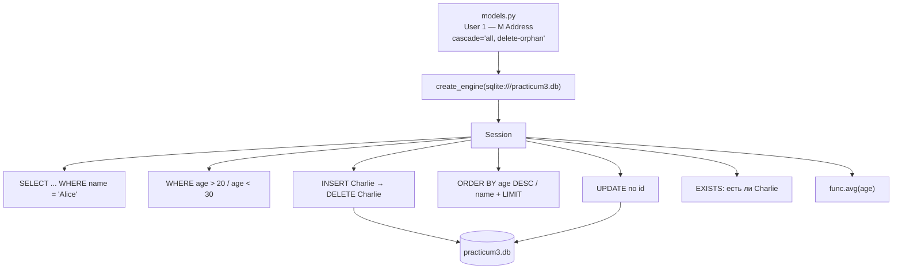

# l09_orm_practice — схема проекта

## Что это

Практика 16.09 — следующее занятие после [`l08_orm_loading`](../l08_orm_loading/SCHEMA.md).
Набор запросов SQLAlchemy по готовой базе: выборка, фильтры, сортировка, `limit`,
вставка, удаление, обновление и агрегат.

| Файл | Роль |
|---|---|
| `app.py` | запросы, по одному на каждое задание |
| `models.py` | модели `User` и `Address`, связь 1:M с `cascade` |
| `practicum3.db` | готовая база: 19 пользователей, 15 адресов |

## Точка входа и запуск

```
cd l09_orm_practice
python app.py
```

`create_engine("sqlite:///practicum3.db")` — путь относительный. Готовая база лежит
**внутри** каталога, поэтому запускать нужно отсюда: иначе подключится пустая новая база
и все выборки вернут пусто, без всякой ошибки.

## Схема



## Отличие от других уроков SQLAlchemy: этот скрипт МЕНЯЕТ базу

`l05`, `l07` и `l08` только читают. Здесь есть `INSERT`, `DELETE` и два `UPDATE`.

**Запускать можно многократно:** операции идемпотентны — Charlie добавляется и тут же
удаляется, возрасты выставляются в фиксированные значения. Проверено тремя запусками подряд:
19 строк до и 19 после, данные совпадают.

Но git всё равно покажет `practicum3.db` изменённым: SQLite после вставки и удаления
перекладывает страницы внутри файла, и байты меняются, хотя данные те же.
Вернуть исходный файл: `git checkout -- l09_orm_practice/practicum3.db`.

## Что было исправлено

* **Результат `scalar()` использовался без проверки.** `print(f"User: {user.id} ...")`
  сразу после запроса: на наполненной базе работает, на пустой падает с
  `AttributeError: 'NoneType' object has no attribute 'id'`.
* **Проверка удаления обращалась к удалённому объекту и стояла вне `if`.**
  `session.get(User, user_to_delete.id)` выполнялась даже в ветке, где пользователь
  не найден, — то есть по `None`. Плюс после `delete` + `commit` объект открепляется
  от сессии, и обращение к его полям даёт `DetachedInstanceError`. Теперь `id`
  запоминается ДО удаления, а проверка перенесена внутрь `if`.
* **`print(f"Deleted user: ..., id: {user_to_delete}")`** печатал весь объект, хотя подпись
  обещает `id`.
* **Мёртвый импорт `Address`** — модель описана в `models.py`, но в запросах этого файла
  не участвует.
* Пустой дублирующий блок комментариев «Обновление данных пользователя по ID» удалён:
  то же задание выполнено ниже.

## Особенности

* **`session.delete()` + `commit()` открепляет объект от сессии.** Поэтому `id` нужно
  сохранить заранее — после удаления читать поля уже неоткуда.
* **`cascade="all, delete-orphan"`** в `models.py`: удаление пользователя удалит и его
  адреса. Без этого в `addresses` остались бы строки с несуществующим `user_id`.
* **`session.scalar(query) is not None`** — идиома проверки существования. Для больших
  таблиц дешевле `select(func.count()).where(...)` или `.limit(1)`.
* **`func.avg` на пустой выборке вернёт `None`, а не 0** — и `f"{None:.2f}"` упадёт.
  Здесь база непустая, поэтому проблема не проявляется.
* **`User.age.desc()`** — то же, что `desc(User.age)`, просто записано методом колонки.

## См. также

* [`l05_orm_relationships`](../l05_orm_relationships/SCHEMA.md) — откуда взялись `select` и `where`;
* [`l07_orm_aggregates`](../l07_orm_aggregates/SCHEMA.md) — `func.avg` и группировка;
* [`info/sqlalchemy/`](../info/sqlalchemy/README.md) — справочник по каждой функции.
