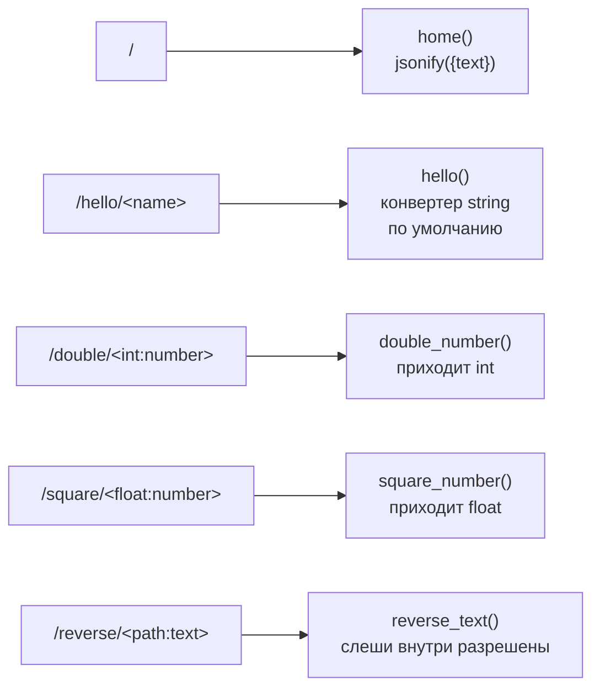

# p01_routing_practice — схема проекта

## Что это

Практика по теме урока [`l01_routing`](../l01_routing/SCHEMA.md): маршруты, конвертеры путей,
ответы в JSON. Пять маршрутов, каждый отрабатывает свой конвертер.

Состояния нет, файлов не читает и не пишет.

## Точка входа и запуск

```
cd p01_routing_practice
python app.py
```

`app.run()` без аргументов → сервер на `http://127.0.0.1:5000`, `debug` выключен.

## Схема



## Чем отличается от урока

`l01_routing` возвращает строки — и в ответ уходит `text/html`.
Здесь всё отдаётся через `jsonify`, то есть `application/json`. Для практики это удобнее:
ответ сразу видно структурой, а не текстом.

## Особенности

Поведение конвертеров проверено запуском, и оно не всегда очевидное:

| Запрос | Ответ | Почему |
|---|---|---|
| `/square/2.5` | 200 | конвертер `float` совпал |
| `/square/4` | **404** | `float` требует точку в записи, целое число не примет |
| `/square/-2.5` | **404** | отрицательные значения `float` по умолчанию не пропускает (есть параметр `signed=True`) |
| `/double/5` | 200 | `int` совпал |
| `/double/5.5` | **404** | `int` пропускает только цифры |
| `/reverse/a/b/c` | 200 | `path` разрешает слеши ВНУТРИ значения |
| `/hello/` | **404** | пустой сегмент не совпадает с `<name>` |

Главный вывод: **404 здесь — не ошибка приложения**. Конвертер просто не совпал, правило
отброшено, и Flask пошёл искать следующее. Если подходящего нет — тогда и получается 404.

* `text[::-1]` — срез с шагом −1, разворачивает строку.
* Правила не конкурируют между собой: у всех пяти разные префиксы, поэтому
  порядок объявления здесь ни на что не влияет (в отличие от `l01_routing`,
  где `/menu` соперничает с `/<name>`).

## См. также

* [`l01_routing`](../l01_routing/SCHEMA.md) — та же тема на «скелетном» примере;
* [справочник по маршрутам](../info/flask/route.md) и [по конвертерам](../info/flask/route.md).
