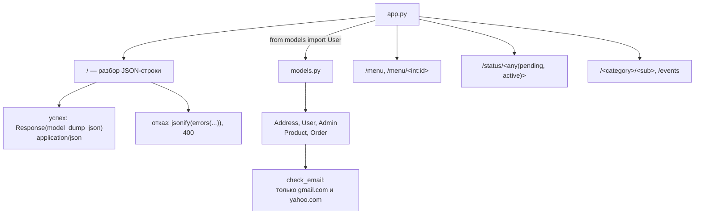

# p02_pydantic_classwork — схема проекта

## Что это

Классная работа к уроку 03.09 — то же занятие, что [`l02_pydantic_models`](../l02_pydantic_models/SCHEMA.md),
но самостоятельно написанное решение. Flask + Pydantic: модель `User` с вложенным `Address`,
валидатор почты, разбор JSON-строки в маршруте `/`.

| Файл | Роль |
|---|---|
| `app.py` | приложение и маршруты |
| `models.py` | модели Pydantic + демонстрация под защитой `__main__` |

## Точка входа и запуск

```
cd p02_pydantic_classwork
python app.py
```

Запускать **из каталога проекта**: в `app.py` стоит абсолютный импорт `from models import User`,
он работает потому, что Python кладёт каталог запускаемого скрипта в `sys.path`.

## Схема



## Чем отличается от урока l02

| | `l02_pydantic_models` | `p02_pydantic_classwork` |
|---|---|---|
| Объявление `email` | `Annotated[EmailStr, Field(...)]` | `EmailStr = Field(...)` — справа от `=` |
| Поле `description` у `Product` | `Annotated[str \| None, Field(default=None)]` | `Annotated[str, Field(default=None)]` |
| Маршрут `/` при отказе | тот же исправленный код | тот же исправленный код |

Оба варианта объявления рабочие. Разница в том, что при записи через `Annotated` значение
по умолчанию остаётся справа от `=`, а ограничения живут в типе — и такой тип можно объявить
один раз (`positive_number`) и переиспользовать в разных моделях.

## Что было исправлено

Исходное решение содержало те же три ошибки, что и код урока, — они разобраны по месту
в комментариях, а неправильные варианты оставлены закомментированными.

* **`from cw1.models import User`** — импорт по старому имени каталога. После переименования
  проект падал с `ModuleNotFoundError: No module named 'cw1'`. Заменено на `from models import User`.
* **`jsonify(e.errors)`** — `errors` это метод. Без скобок в сериализацию уходит объект метода:
  `TypeError: Object of type builtin_function_or_method is not JSON serializable`.
* **`jsonify(e.errors())`** — со скобками тоже 500: в ключе `ctx` лежит исходный `ValueError`
  из `check_email`, а объект исключения не сериализуется. Нужен `include_context=False`.
  Проверено запуском — обе ловушки воспроизводятся и здесь.
* **Код ответа.** На ошибку валидации уходил `200`. Теперь `400`.
* **Демонстрация в `models.py`** выполнялась при каждом импорте, то есть при каждом старте
  сервера, и печатала в консоль пойманную `ValidationError`. Закрыта защитой `__main__`;
  запустить отдельно: `python models.py`.
* Неиспользуемый импорт `List` удалён.

## См. также

* [`l02_pydantic_models`](../l02_pydantic_models/SCHEMA.md) — тот же урок;
* [`info/pydantic/errors.md`](../info/pydantic/errors.md) — подробный разбор обеих ловушек `errors`.
