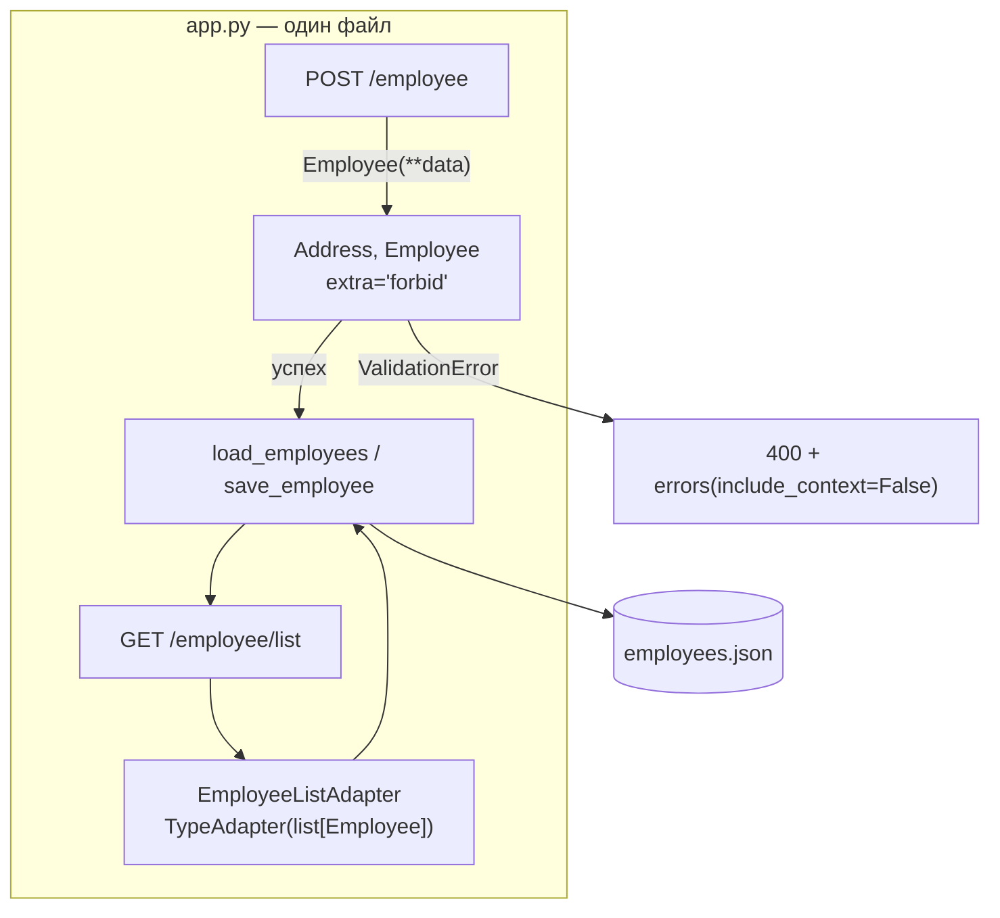

# p03_rest_api_classwork — схема проекта

## Что это

Классная работа к уроку 04.09: REST API «сотрудники» — но **одним файлом**.
Тот же урок разложен по слоям в [`l03_rest_api`](../l03_rest_api/SCHEMA.md).
Сравнение двух подходов — главная ценность этой папки.

| Файл | Роль |
|---|---|
| `app.py` | всё сразу: модели, хранилище, маршруты |
| `employees.json` | файл-хранилище, перезаписывается приложением |

## Точка входа и запуск

```
cd p03_rest_api_classwork
python app.py
```

`FILE_NAME = 'employees.json'` — путь относительный и разрешается от рабочего каталога
процесса. Запуск из другого места ошибки не даст: приложение молча создаст пустой
`employees.json` там, откуда его запустили.

## Схема



## Чем отличается от урока l03

| | `l03_rest_api` | `p03_rest_api_classwork` |
|---|---|---|
| Структура | четыре модуля: `app` / `schemas` / `utils` / `settings` | один файл |
| Лишние поля во входных данных | `'ignore'` — молча отбрасываются | **`extra='forbid'`** — ошибка |
| Вычисляемые поля | `years_worked`, `actual_salary` через `computed_field` | нет |
| Пакетная загрузка | `POST /employees/batch` | нет |
| Ответ об ошибке | модель `ErrorResponse` | список `errors()` как есть |

**`extra='forbid'` здесь — сильная сторона решения.** Опечатка в имени поля (`ctiy` вместо
`city`) в уроке прошла бы молча, а значение потерялось. Здесь она даёт понятный `400`.
Проверено запуском.

Разбиение на модули, наоборот, сильная сторона урока: когда файл вырастет, искать
в нём модели среди маршрутов станет тяжело.

## Что было исправлено

* **`GET /employee/list` отдавал 500.** Тело обработчика было `pass`, функция возвращала
  `None`, и Flask отвечал `The view function ... did not return a valid response`.
  Маршрут выглядел рабочим, пока в него не постучишься. Теперь он читает файл и отдаёт список.
* **Метод маршрута был `POST`.** Чтение списка — это `GET`; `POST` означает «создай что-то».
* **Мёртвые импорты** `cast`, `datetime`, `field_validator`, `computed_field` удалены.
  `TypeAdapter` остался и теперь используется — им сделан обработчик списка.
* **`json.dump(data, f)`** писал кириллицу как `\uXXXX` и одной строкой.
  Добавлены `ensure_ascii=False, indent=4` — файл стало можно открыть глазами.
* **`request.get_json()`** без `force=True` отдавал 415, если клиент забыл заголовок
  `Content-Type: application/json`. Частая история при проверке через curl.
* **`e.errors()`** без `include_context=False` работает, пока в моделях нет своего
  валидатора, бросающего `ValueError`. Как только появится — будет 500, и не там, где ждут.
  Флаг добавлен на будущее.

## Особенности

* **Запись не атомарна.** Каждый POST читает файл целиком, дописывает в память
  и перезаписывает в режиме `"w"`. Два одновременных запроса потеряют одну запись.
* **`save_employee` читает файл на каждый запрос** — для учебного примера нормально.
* `mode='json'` в `model_dump` обязателен: без него `hire_date` останется объектом `date`,
  и `json.dump` упадёт с `Object of type date is not JSON serializable`.

## См. также

* [`l03_rest_api`](../l03_rest_api/SCHEMA.md) — тот же урок, разложенный по слоям;
* [`info/pydantic/TypeAdapter.md`](../info/pydantic/TypeAdapter.md), [`info/pydantic/ConfigDict.md`](../info/pydantic/ConfigDict.md).
