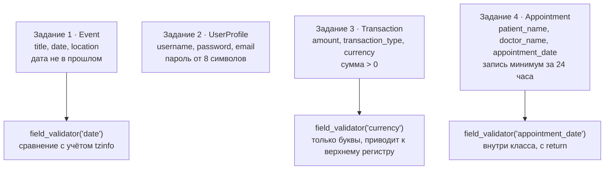

# p06_pydantic_tasks — схема проекта

## Что это

Практическая работа: четыре задания на модели Pydantic. Те же четыре задания решены
в [`l06_practice`](../l06_practice/SCHEMA.md) — это **второе, независимое решение**,
и местами оно удачнее.

Flask не используется: это обычный скрипт, он выполняется сверху вниз и печатает результат.

## Точка входа и запуск

```
cd p06_pydantic_tasks
python app.py
```

Файлов не читает и не пишет.

## Схема



## Чем отличается от l06_practice — и где лучше

| | `l06_practice` | `p06_pydantic_tasks` |
|---|---|---|
| Задание 3, тип суммы | `float` | **`Decimal`** — точнее для денег |
| Задание 3, валюта | только `max_length=3` | + валидатор: только буквы, приводит к `USD` |
| Задание 4, валидатор | **был объявлен вне класса** и не вызывался | сразу внутри класса, с `return` |
| Задание 4, часовой пояс | изначально не учитывался | учитывался с самого начала |
| Задание 4, условие | «не раньше текущего момента» (по тексту задания) | строже: минимум за 24 часа |

Два решения полезно читать рядом: одна и та же задача, разные компромиссы.

## Что было исправлено

* **Задание 1 сравнивало дату с голым `datetime.now()`.** Наивное время без пояса;
  дата с поясом дала бы `TypeError: can't compare offset-naive and offset-aware datetimes`.
  Теперь `datetime.now(v.tzinfo) if v.tzinfo else datetime.now()` — как в задании 4.
* **`patern_name`** — опечатка в слове `patient`. Имя поля это часть контракта: клиент,
  присылающий корректное `patient_name`, получил бы «поле обязательно» и не понял бы, чего
  от него хотят.
* **Не было поля `doctor_name`**, хотя условие задания его требует. Добавлено.
* **`min_allower`** — опечатка в имени переменной, исправлена на `min_allowed`.
* Сообщение об ошибке в задании 4 говорило «должны быть в будущем», хотя проверка требует
  запас в 24 часа. Текст приведён в соответствие с проверкой.

## Особенности

* **Правило 24 часов строже условия задания.** Это осознанное ужесточение — регистратуре
  нужен запас времени. Оставлено как есть, но о расхождении с текстом задания стоит знать.
* **`except ValueError` ловит и `ValidationError`** — она наследник `ValueError`.
* **`Decimal('100.50')` против `float`.** Для денег `float` неточен: `0.1 + 0.2 != 0.3`.
  Здесь взят `Decimal`, и это правильный выбор.
* Валидатор `currency_validator` не просто проверяет, но и **нормализует** значение:
  возвращает `v.upper()`, поэтому `'usd'` превращается в `'USD'`. Валидатор вправе менять
  значение — главное, вернуть его.

## См. также

* [`l06_practice`](../l06_practice/SCHEMA.md) — те же задания, другое решение;
* [`info/pydantic/field_validator.md`](../info/pydantic/field_validator.md) — разбор ловушек валидаторов.
