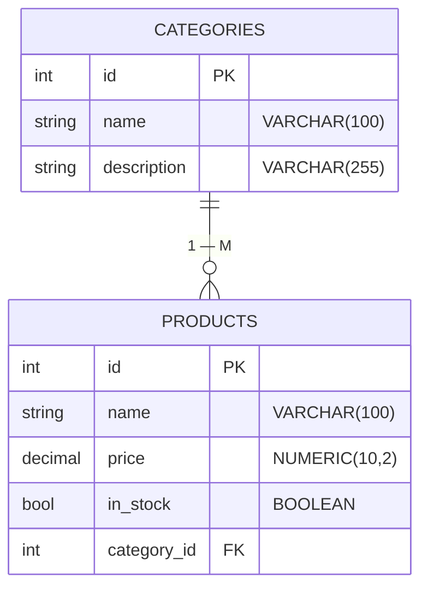
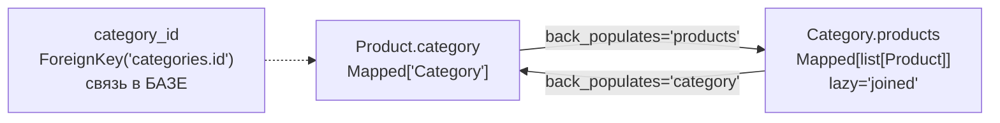

# p09_orm_homework — схема проекта

## Что это

Домашняя работа 3: описать схему интернет-магазина на SQLAlchemy — товары и категории.
Тот же блок занятий, что и [`l09_orm_practice`](../l09_orm_practice/SCHEMA.md), только там
запросы к готовой базе, а здесь — описание схемы с нуля.

Теория по связям разобрана раньше, в [`l05_orm_relationships`](../l05_orm_relationships/SCHEMA.md).

| Файл | Роль |
|---|---|
| `app.py` | обе модели и создание таблиц |

Задания 1–5 выполнены: движок, сессия, `Product`, `Category`, связь между ними.
Блок сессии внизу пустой — заданий на запросы в эту работу не входило.

## Точка входа и запуск

```
cd p09_orm_homework
python app.py
```

Скрипт создаёт `shop.db` в текущем каталоге и завершается — вывода нет, это нормально.
Файл в репозиторий не попадает: он в `.gitignore`, как и базы `l04_orm_basics`.

Проверить результат:

```
python -c "import sqlite3; print([r[0] for r in sqlite3.connect('shop.db').execute(\"select sql from sqlite_master where type='table'\")])"
```

## Схема



Связь объявлена с обеих сторон через `back_populates`:



## Чему учит эта работа

**`Numeric(10, 2)` в паре с `Mapped[Decimal]` — правильный выбор для денег.**
`10` — всего значащих цифр, `2` — после запятой. `Float` здесь не годится: двоичная дробь
не представляет `0.1` точно, и суммы уезжают на копейки (`0.1 + 0.2 != 0.3`).
Та же мысль в `p06_pydantic_tasks`, где для суммы транзакции взят `Decimal`.

**Два уровня связи рядом в одной модели.** `category_id` с `ForeignKey` — связь в базе,
обычная колонка с числом. `category` с `relationship` — связь в коде, готовый объект.
Это разные вещи, и обычно нужны обе.

## Особенности

* **`lazy="joined"` на коллекции требует `.unique()`.** Товары приедут тем же запросом,
  одним `LEFT OUTER JOIN`, — но `JOIN` размножает строку категории по числу её товаров.
  Выборку придётся схлопывать:

  ```python
  session.scalars(select(Category)).unique().all()
  ```

  Без `.unique()` SQLAlchemy откажется отдавать результат:
  `InvalidRequestError: The unique() method must be invoked on this Result`.
  Проверено запуском. Для коллекций чаще берут `lazy="selectin"` — два запроса, без дублей.
  Разбор стратегий — [`info/sqlalchemy/lazy.md`](../info/sqlalchemy/lazy.md).

* **`mapped_column()` без аргументов можно опустить.** `in_stock: Mapped[bool] = mapped_column()`
  и `in_stock: Mapped[bool]` дают одинаковый результат: тип выводится из аннотации.
  Вызов нужен, только когда есть что передать — `primary_key`, длину, `ForeignKey`.

* **`ForeignKey("categories.id")` — имя ТАБЛИЦЫ, а не класса.** Частая ошибка — написать
  `ForeignKey("Category.id")`.

* **Все поля `NOT NULL`.** `Mapped[str]` без `| None` означает обязательную колонку —
  это видно в созданной схеме. Для `description` категории это может оказаться неудобным.

* **SQLite по умолчанию не проверяет внешние ключи.** Вставить товар с несуществующим
  `category_id` он позволит, пока не выполнен `PRAGMA foreign_keys=ON`.

## См. также

* [`l05_orm_relationships`](../l05_orm_relationships/SCHEMA.md) — `ForeignKey` и `relationship`;
* [`l09_orm_practice`](../l09_orm_practice/SCHEMA.md) — запросы того же блока;
* [`info/sqlalchemy/relationship.md`](../info/sqlalchemy/relationship.md),
  [`info/sqlalchemy/String.md`](../info/sqlalchemy/String.md) — про `Numeric` и деньги.
